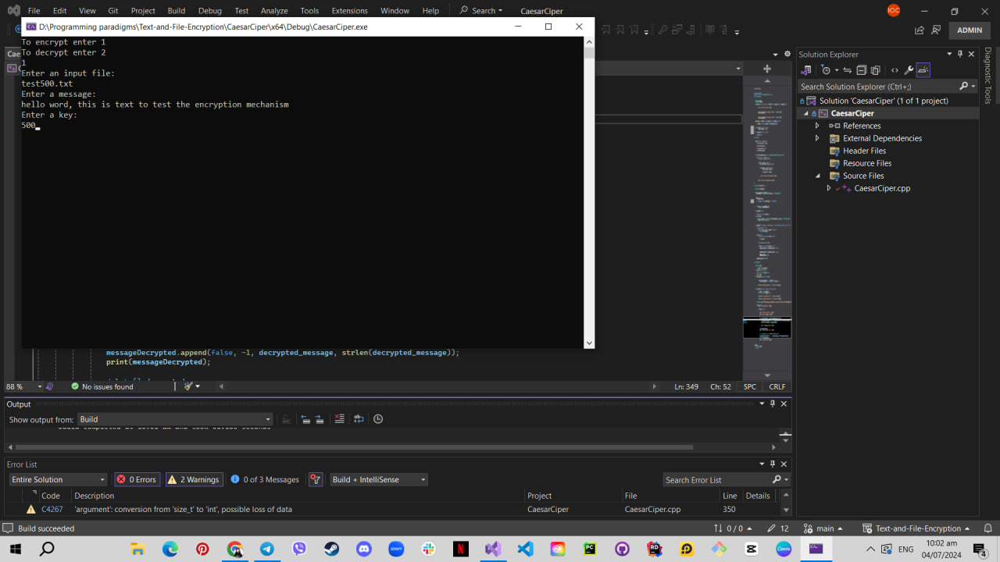
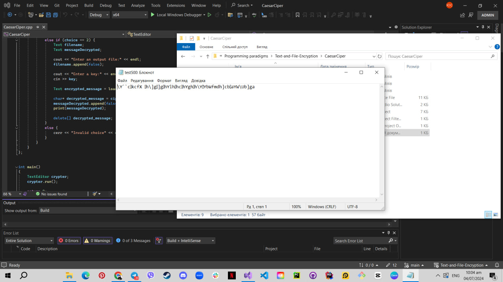
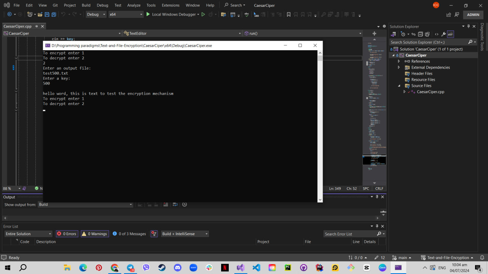

# Text Encryption and Decryption Program

This program allows users to encrypt and decrypt messages using a specified key. Follow the steps below to test the encryption and decryption functionalities.

## Steps to Test the Program

1. **Encrypt a Message**
    - Run the program.
    - Select the option `1` to encrypt a message.
    - Enter the message you want to encrypt.
    - Enter a long key for encryption and press `Enter`.
    - The encrypted message will be saved to `test500.txt`.

    

2. **Verify Encrypted Message**
    - Close the program.
    - Open the file `test500.txt` to ensure the encrypted text is saved correctly.

    

3. **Decrypt the Message**
    - Run the program again.
    - Select the option `2` to decrypt a message.
    - Enter the filename (`test500.txt`) and the key used for encryption.
    - Press `Enter` to see the decrypted message.

    
